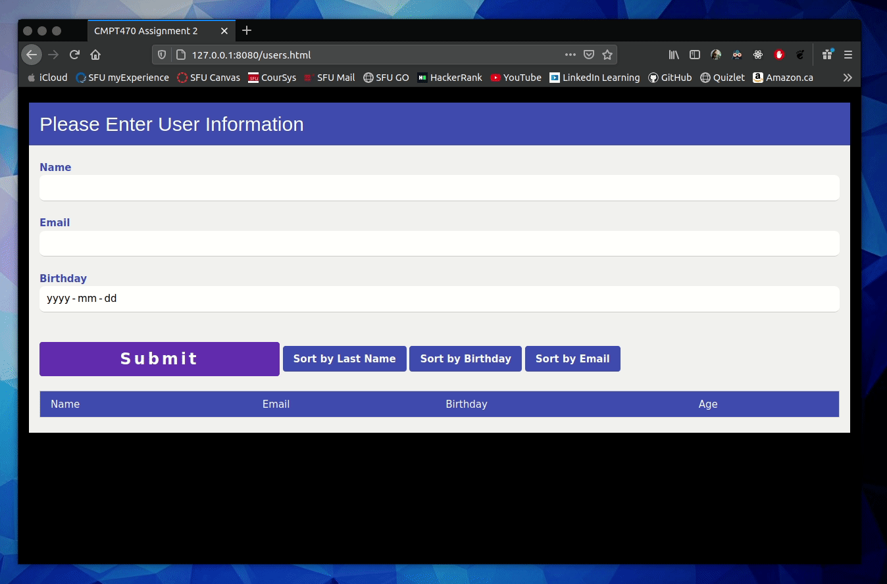

# CMPT470 Web-based Info Systems Assignment 2

http://www.sfu.ca/outlines.html?2020/fall/cmpt/470/d100

### Showcase

### Details

In this assignment we created a form with input for user names, emails & birthdays

Each time the user clicks on the button, the new user is added to the HTML file 
and the data object is added to the DOM. The age of the current users and a row
containing the average ages is displayed. For example, after entering three users,
something like this should be displayed on your page:

Users:
Name | Email | Birthday | Age
-----|-------|----------|-----
Jane | Doe | jdoe@domain.ca | 1990-10-03 | 30
Joe | Smith | joesmith@domain.ca | 1985-06-07 | 35
Steve | Smith | smith@domain.ca | 1994-12-12 | 25
The average age of users is 30.667.

In addition, three buttons allow the user to display the users in
sorted order of each of the inputs described earlier. For example, clicking on 
the “SORT by BIRTHDAY” will now display the names as:

Name | Email | Birthday | Age
-----|-------|----------|-----
Steve | Smith | smith@domain.ca | 1994-12-12 | 25
Jane | Doe | jdoe@domain.ca | 1990-10-03 | 30
Joe | Smith | joesmith@domain.ca | 1985-06-07 | 35
The average age of users is 30.667.

##### CSS

A CSS framework was used for styling, found here: 
https://www.w3schools.com/w3css/default.asp

##### Creating a Web Server

The purpose of this part of the assignment was to create a Windows Server 2016 
virtual machine on Google Cloud, install IIS, and to set up a test website.
